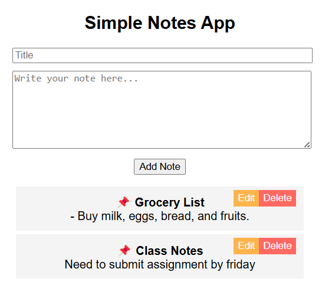

# Simple-Notes-App
This is a Simple Notes App using HTML, CSS, and JavaScript.
## Overview
The Simple Notes App allows users to add, edit,  and delete notes. Each note has a title and content, displayed in a list. Users can edit notes via pop-up prompts and  delete them with a button. The design is minimal, with basic styling for readability and usability.
## Features
Quickly add and save text-based notes.
Update or remove notes anytime.
Minimal UI with quick performance.
## How it works
1.Enter a title and content, then click "Add Note" to create a note.
2.Notes appear in a list below with Edit and Delete buttons.
3.Edit opens a prompt to change the title and content.
4.Delete removes the note from the list.
5.All actions happen in the browser — no backend or storage used.
6.Built with HTML, CSS, and vanilla JavaScript.
## 🛠️ Built With
•HTML(Requests module)
•Inline CSS
## Sample Output 

